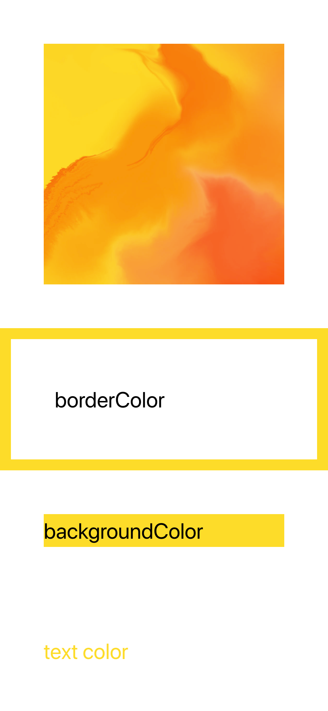

# colordom.js
## A thin wrapper over [color.js](https://github.com/luukdv/color.js) which allows you to apply an image's dominant color to any DOM element's color styles (like background color, border color, text color, etc.)
To prevent recomputing a color, it stores the color value after the first time it figures it out. 

```html
<div color-backgroundColor="https://via.placeholder.com/150"></div>
```

```html
<div color-borderColor="https://via.placeholder.com/150"></div>
```

```html
<div color-color="https://via.placeholder.com/150">text</div>
```



## Scripts 
### Development
`npm run dev`
### Build
`npm run build` 
### Publish
`npm version x.x.x` 
`npm publish`